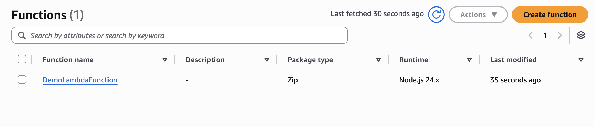
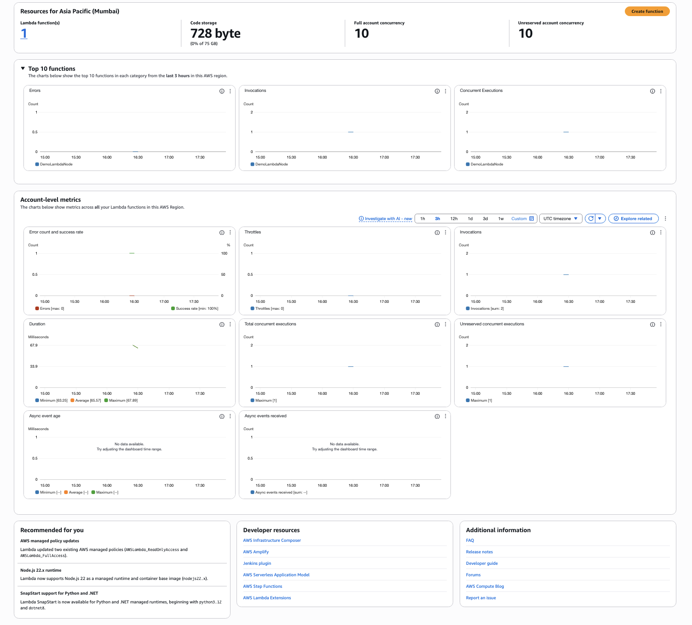
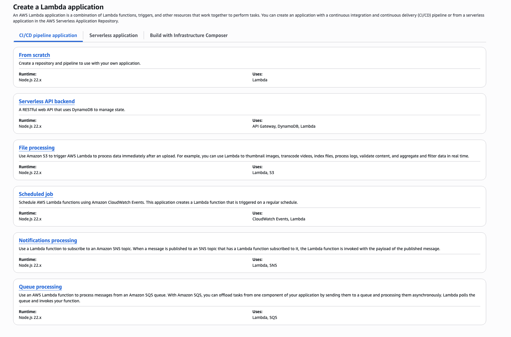
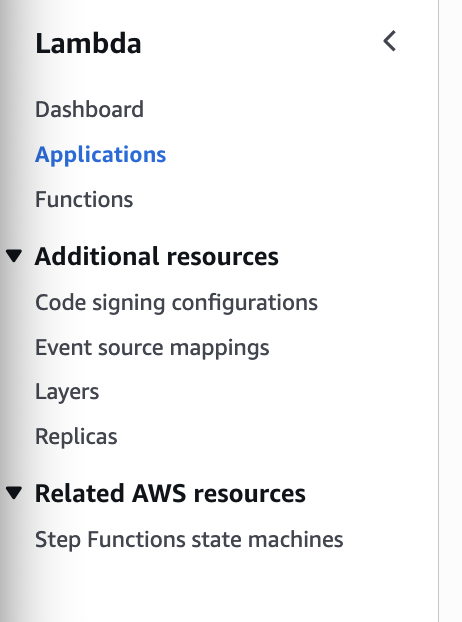

# A Tour of the Lambda Console 

## Accessing Lambda in AWS Console 

- Open AWS Console → Use the **Services search box** → Select **Lambda**
- Make sure to **check your AWS Region** (top right).
- Lambda functions are **region-specific** — a function created in `us-east-1` won’t appear in `us-east-2`.

## Lambda Console Overview 

- Default landing page shows the **Functions** section.
- If there are functions, they appear in **alphabetical order**.
- Use **Create function** button to start building functions.

## Dashboard Section

- Gives **high-level account-level metrics** for all Lambda functions.
- Shows:
  - Number of Lambda functions
  - **Code storage** used (max limit = **75 GB**)
  - Concurrency limits
    - Default account concurrency = **1000**
    - **Unreserved concurrency** = shared pool for all functions
- Useful metrics displayed:
  - **Errors**
  - **Success rate**
  - **Throttles**
  - **Invocations**
  - **Duration**
  - **Concurrent executions**
  - **Unreserved concurrent executions**

> Metrics are aggregated across **all functions in the region** — good for bird’s-eye monitoring.

## Applications Section

- Shows **pre-built serverless application templates**.
- Helps deploy sample apps using Lambda + other AWS services (API Gateway, DynamoDB, etc.)
- Example template: **Serverless API Backend** (Node.js runtime)
- This section simplifies setup, but **not used in manual learning or CDK projects**.

## Other Console Features(Left Menu)

- **Code Signing**:

  - Uses **AWS Signer** to validate and restrict code updates.

  - Ensures only trusted sources can deploy to Lambda (security feature).

- **Layers**:

  - Allows sharing **common dependencies/libraries** across multiple Lambda functions.
  - Helps avoid duplicating packages inside each Lambda bundle.

- **Step Functions**:

  - Workflow orchestration tool that integrates with Lambda.