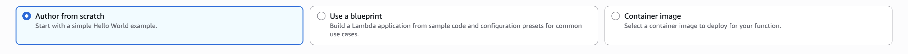

# Creating our first function

### Navigation

- If the **left navigation pane** is missing, click the **three horizontal lines** (hamburger menu) to open it.
- Go to **Lambda → Functions → Create function** (top-right button).

## Ways to create a Lambda Function

**Author from scratch** (most common)

- Gives a minimal starter file (Hello World).
- You implement everything manually.

2. **Use a blueprint**

- Pre-configured templates for common tasks.
- Example: **API Gateway + DynamoDB REST API** blueprint.
- Helpful for beginners, but for deep learning better start from scratch.

3. **Container image**

- Deploy Lambda using a Docker image.
- Uses **ECR (Elastic Container Registry)** as the image store.
- Useful when dependencies are large or need custom OS packages



##  Authoring a Lambda(Node.js)

- **Basic input fields**

  - **Function name** (letters/numbers/hyphens/underscores)

  - Runtime→ choose Node.js

  - Common versions: Node.js 18.x / Node.js 20.x

  - Architecture→ choose ARM64(Graviton2)
    - cheaper & faster than x86

- **Permissions (IAM Role)**

  - Lambda creates a **basic execution role** with CloudWatch logging permissions.

  - You can:
    - Use default basic execution role (recommended for first time)
    - Select an **existing role**
    - Create a role from template policies (not recommended normally)
  - The execution role controls what AWS resources Lambda can access (S3, DynamoDB, etc.).
  - Advanced Settings
    - VPC
      - You **don’t need a VPC** unless accessing private network resources (e.g., RDS).
      - Leaving VPC **empty** means public network and faster cold starts.
  - Code Signing (optional)
    - Ensures only trusted, verified code is deployed.
  - After Function Creation

- Function Overview section shows:

  - **Triggers**: integrations like S3 / API Gateway / EventBridge / SQS, etc.
  - **Layers**: additional shared dependencies
  - **Destination**: where results go (e.g. SQS on failure)
  - **ARN**: unique ID for the Lambda function

- Code Source

```
export const handler = async (event) => {
  // TODO implement
  const response = {
    statusCode: 200,
    body: JSON.stringify('Hello from Lambda!'),
  };
  return response;
};
```

- Key parts

  - `handler` is the **entry point**

  - Must match the Handler config on the console, e.g.:
    - Handler: `index.handler`
    - Means: file `index.js` and function `handler`
  - Common mistakes:

  - Wrong file name (`app.js` vs `index.js`)

  - Wrong export name

  - Missing `event` & `context` params

## Additional Panels

- **Test** tab: invoke function with dummy data
- **Monitor** tab: logs, metrics, cold starts
- **Configuration** tab: environment vars, timeout, memory, concurrency, triggers, permissions
- **Versions & Aliases**: deploy multiple versions (blue/green)

