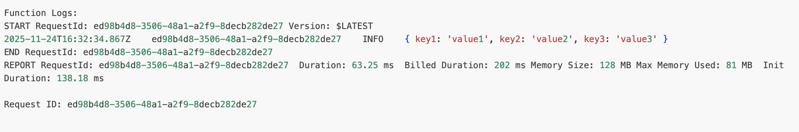

# Invoking an AWS Lambda Function

## Editing & Deploying Code

- You can modify Lambda code directly in the **AWS Console editor**, but this is **not recommended for production**.
- Typically develop using **Infrastructure as Code** (e.g., AWS CDK).
- After editing code → **click Deploy** to publish a new version of the function.
- Always **deploy before testing**, otherwise the old version will run.

## Creating & Using Test Events

- Go to **Test → Configure test event** to create a test payload.
- A Lambda function can have **up to 10 saved test events**.
- Events persist across browsers/devices.
- Useful when your Lambda integrates with services like **S3 / API Gateway / DynamoDB / EventBridge**, because **each passes different event formats**.
- Choose a template (e.g., **Hello World**), edit JSON, format it, and **Save**.

## Running the Test

- Click **Test** to invoke the Lambda with the saved event.
- Output shows:
  - Test event name
  - Response (null if nothing returned)
  - Logs (console output)
  - Execution report

## Invocation Metadata Shown in Logs

- **Request ID**: a unique UUID that identifies a single invocation (useful for tracking/debugging).
- **Duration**: actual compute time taken.
- **Billed duration**: billing rounding (now per millisecond instead of 100ms).
- **Memory configured** vs **memory used**.
  - Example: 128MB configured, 50MB used.
- Cold Starts
  - Appears in logs as **Init Duration**
  - Happens when:
    - First invocation after deploy/update.
    - Scaling to new instances due to increased load.
  - Lambda loads runtime + dependencies → overhead (e.g., 135ms for example here).
  - Different languages/dependencies affect cold start time.
  - Warm start means Lambda already has an execution environment ready.



## Events & Context Objects

### `event`

- Contains the **input data passed to Lambda**
- Example for API Gateway: user input, query params, body, headers.
- Can be logged: `console.log(event)`
- Access values like: `event.key1`

### `context`

- Provides info about the execution environment.
- Most important value: **remaining time before timeout**.
- Used to decide whether to continue or stop long-running logic.

## Important Limitation

- Lambda runtime duration is **1 second to 15 minutes max**.
- Long processes must be broken into smaller tasks or chained.

## Printing & Reading Event Data Example(Node.js)

```js
exports.handler = async (event, context) => {
  console.log(event); // whole event payload
  const value = event.key1;
  console.log(value);
};
```

