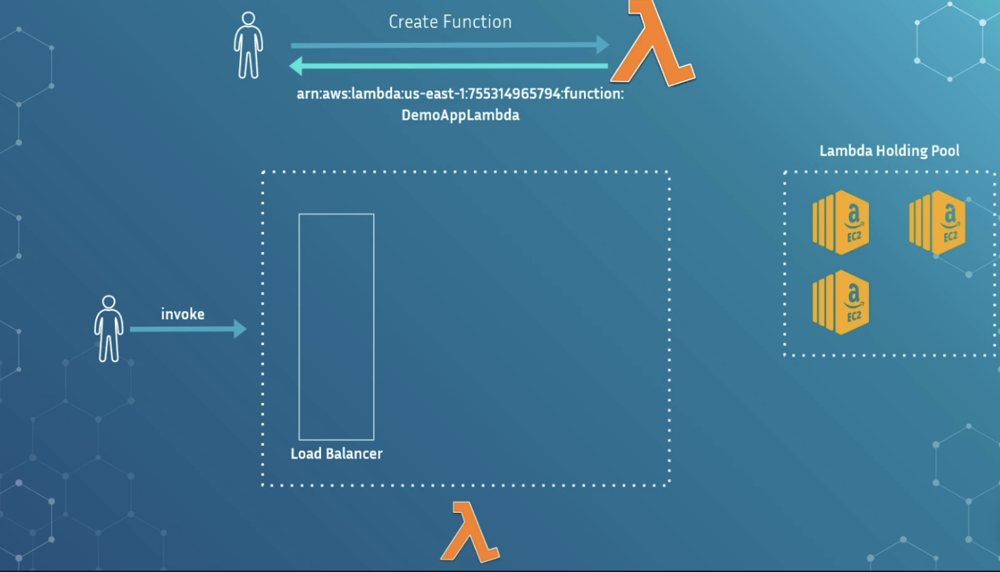
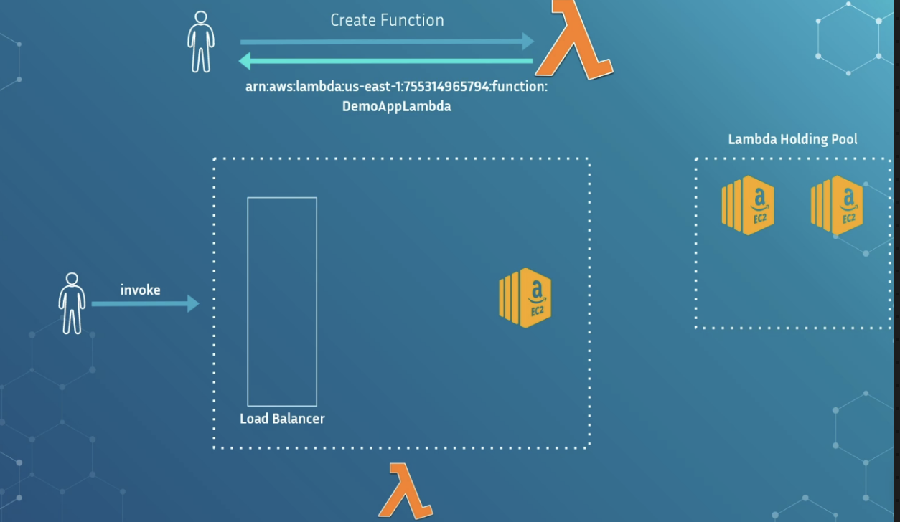
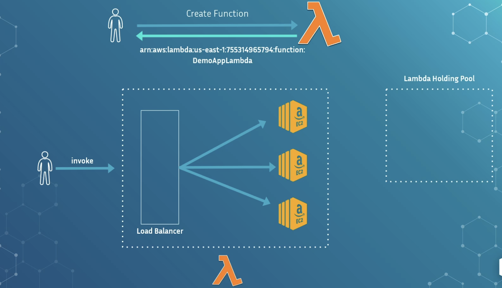

# How AWS Lambda Works Behind the scenes 

## The Myth of Serverless

- Despite the name, **Lambda is not literally server-less**.
- There *are servers*—AWS just handles all provisioning & lifecycle under the hood.
- The serverless feel is a **transparent orchestration layer** that hides infrastructure complexity.

## What Happens When You Invoke a Lambda ? 

- **User triggers Lambda**

  - Either from AWS Console, API Gateway, or Infra-as-Code.
  - AWS assigns an **ARN** (Amazon Resource Name) which uniquely identifies the Lambda.

- ### **Request flows through a Load Balancer**

  - AWS uses an internal **load balancer** to route requests to compute resources.

- Lambda Holding Pool

  - AWS maintains a **pool of pre-initialized resources** (EC2-like compute / containers).
  - These machines are **not specific to you**; they’re shared across customers until needed.

## Cold Start

- Triggered when no warm environment exists. Process:
  - AWS pulls a machine from holding pool.
  - Loads your Lambda code + runtime + dependencies + layers.
  - Registers this instance with the load balancer.
  - Executes your request.

## Scaling(Bursts of Traffic)

- Lambda spins up **more compute containers from holding pool**.
- Each new container must also cold start once.
- Scaling is automatic and transparent.

## Warm State /Reuse

- After cold start, the compute environment stays alive for **~30–60 minutes** (not officially guaranteed).

- Subsequent invocations of the same function run much faster.

- ### Warm environment retained:

  - When function keeps getting periodic traffic.
  - Results in very low latency (warm start).

## **When Environments Expire**

- AWS automatically releases idle containers back into the pool when:
  - No more requests for a while (approx 30–60 mins).
  - Account scaling down.
- Next invocation after that → **cold start again**.

