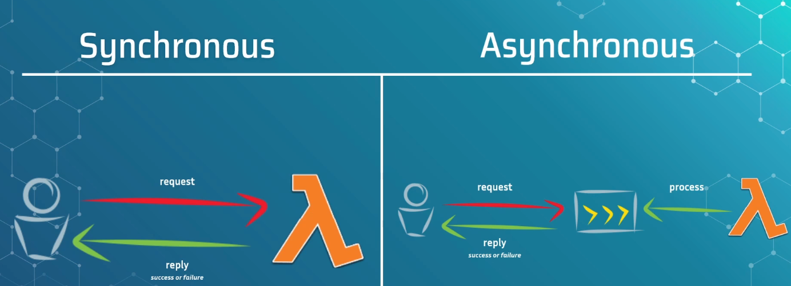

# Synchronous and Asynchronous Invocations

## Two Invocation Types

- Lambda supports **Synchronous** and **Asynchronous** invocation.
- You choose which one to use at **invoke time**, not at function creation.
- Switching between the two is just a parameter change in the SDK.

## Synchronous Invocation

- Classic **request → processing → response** flow.
- Caller waits until Lambda finishes running.
- Caller **immediately knows**:
  - Success or failure
  - Output (if any)
- Matches traditional API request-reply behavior.
- Good for:
  - APIs
  - Use cases where you need immediate acknowledgement
  - Workflows that depend on the exact result
- Bad for:
  - Long chains of Lambda → Lambda → Lambda
  - High-latency operations
  - Scenarios where waiting increases your compute bill

## Asynchronus Invocation

- “**Fire and forget**” model.

- Caller sends the event; once it's **queued**, caller gets a quick response (200 OK or immediate failure).

  After the event is queued, an **internal AWS process** later:

  - Picks up the event
  - Invokes the Lambda
  - Deletes the event from the queue if successful

- Caller **never knows** the final result.

- Internal Queue Behavior

  - Queue is invisible to you.

    If there's backlog, Lambda may be invoked with **delay**:

    - Usually milliseconds
    - Can reach **seconds or minutes** under heavy backlog

    Not suitable when the caller requires:

    - Real-time feedback
    - Guaranteed immediate processing

## Why Use Asynchronus Invocation ? 

- Fault-tolerant jobs
- Periodic jobs triggered by timers (CloudWatch Events)
- Workloads where occasional failure doesn’t matter
- Much cheaper when used correctly
- Avoids synchronous chains that double your billing

## Failure Handling for Asynchronous Invocations

- Retry Behavior

  - Lambda automatically retries failed async events.

    Typically **3–10 retries** depending on configuration.

- Retry Loop
  - Lambda processes event
  - Fails
  - Event is returned to the queue
  - Internal process picks it again
  - Repeat until retry limit is reached
- Eventually → retries stop to avoid infinite loops.

## Dead Letter Queue(DLQ)

- After all retries fail, event is pushed into a **DLQ** (usually SQS).
- DLQ contains the **failed event payload**.
- You should typically set an alert:
  - "If DLQ has ≥ 1 message → notify me"
- DLQ = your safety net for failed asynchronous processing.

## Why Invocation Type Matters

- **Cost Impact** 

  - Synchronous chains cause **double billing**.

  - Example:

    - Lambda A (short) synchronously calls Lambda B (long).

    - A waits the full duration of B.

  - You pay for:
    - A’s waiting time
    - B’s processing time
  - Same time billed twice.

- Suitability for Use Case

  - Asynchronous works well if:
    - The task repeats frequently
    - A failed run will be retried anyway at next schedule
    - Caller doesn’t need the result
  - Failure Visibility
    - Synchronous → caller immediately sees the failure.
    - Asynchronous → caller never knows unless you surface the error via DLQ or monitoring.