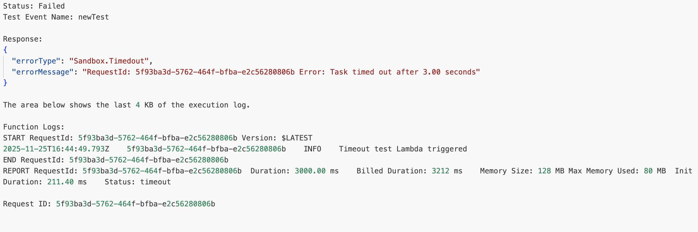

# Hands on Duration and Timeouts

## What a Timeout Is ? 

- A timeout occurs when your Lambda function runs longer than its configured maximum execution time.
- By default, newly created functions have a **3-second timeout**, but you can increase this up to **15 minutes**.

## Demonstrating a Timeout

- If your function sleeps for 4 seconds but the timeout is set to 3 seconds, the function will **always** timeout.

- Example : Node.js

  ```js
  export const handler = async (event) => {
    console.log("Timeout test Lambda triggered");
  
    // Sleep for 4 seconds
    await new Promise(resolve => setTimeout(resolve, 4000));
  
    console.log("This line will never run if timeout = 3 seconds");
  
    return {
      message: "Completed"
    };
  };
  ```

After invoking the function:

- The console shows an **error response**
- The message indicates:
   *Task timed out after 3.00 seconds*
- CloudWatch logs show:
  - **Duration** ~3000+ ms
  - **Billed duration** ~3000 ms
  - A final line: *Task timed out after 3.00 seconds*



## Practical Tip

- Create a CloudWatch alarm at around **80%** of your timeout.
- Example: if timeout = 10s, set an alarm when duration hits ~8s.
- This gives an **early warning** before actual timeouts occur.

