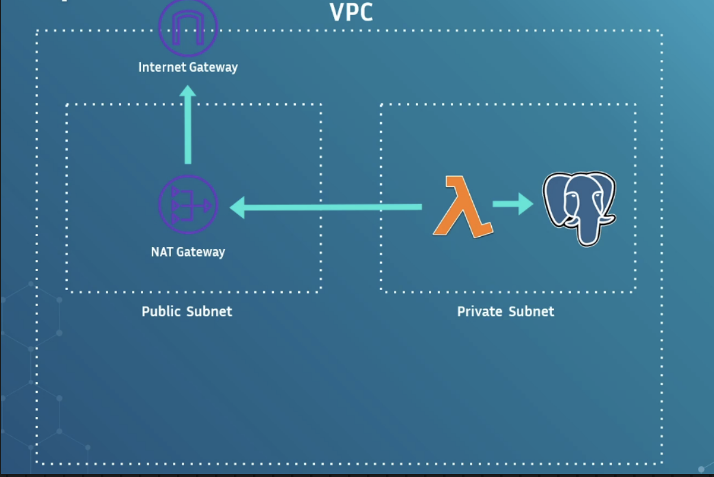
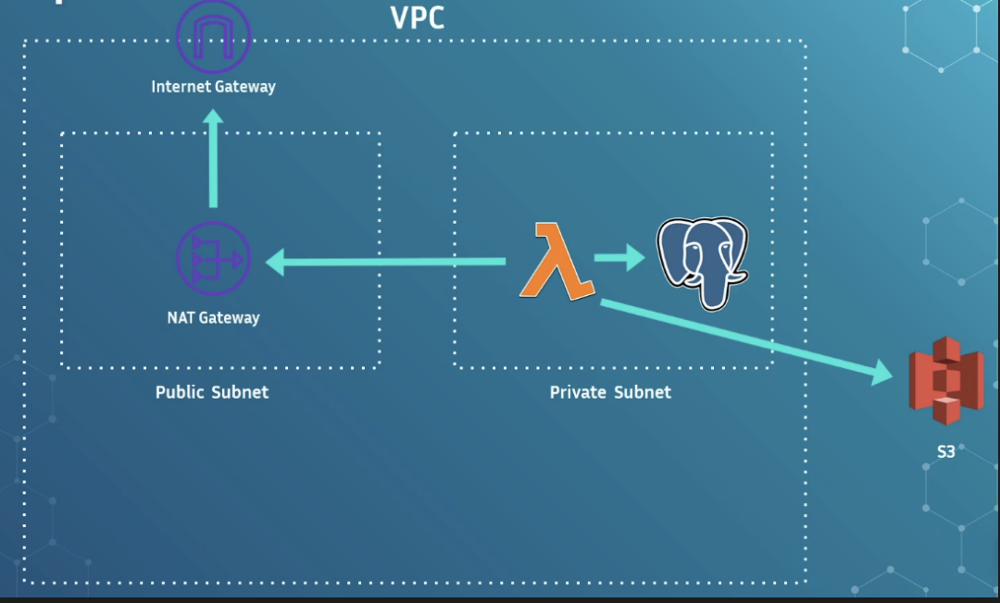

# VPC

### VPC Basics

- VPC = **Virtual Private Cloud**.
- Creates an **isolated private network** inside AWS.
- Lets you control **inbound and outbound traffic**.
- Used to securely host resources like **databases, EC2, Lambda**, etc.

------

### Public vs Private Subnets

- **Public Subnet:**
  - Has access to the public internet (if route table allows).
- **Private Subnet:**
  - No direct inbound or outbound internet access.

------

### Why VPCs Matter

- Critical for **security and compliance**.
- Used when storing sensitive data (names, IDs, banking info).
- Databases and sensitive compute should live in **private subnets**.

------

### Lambda and VPCs

- When creating a Lambda function, you can choose whether it runs **inside a VPC**.
- Only required if Lambda needs to access resources **not publicly accessible** (example: private RDS, Elasticache, Elasticsearch).

------

### Avoiding Public Exposure

- Example: You *can* give RDS a public IP, but doing so exposes it to attacks.
- Best practice: keep resources private and run Lambda in the **same VPC**.

------

### ENIs (Elastic Network Interfaces)

- AWS creates **ENIs** for Lambda when placed inside a VPC.
- In the past, ENI creation added **significant cold start latency** (sometimes up to 15 seconds).
- AWS solved this in **2019** with a feature called **Hyperplane**.
- Result: VPC-enabled Lambdas no longer suffer cold-start penalties.

------

### Internet Access for Private Subnets

- Lambda in a private subnet does **not** have public internet access by default.
- To enable outbound calls (e.g., third-party APIs) you need:
  - **NAT Gateway** (paid resource)
  - **Internet Gateway** (free)
- Traffic goes: Lambda → NAT Gateway → Internet Gateway → Internet.

------

### VPC Endpoints

- Provides **private connectivity** to supported AWS services.
- Currently supports: **S3 and DynamoDB**.
- Allows traffic to stay inside the AWS network instead of going through the public internet.
- Improves **security** and reduces **latency**.

