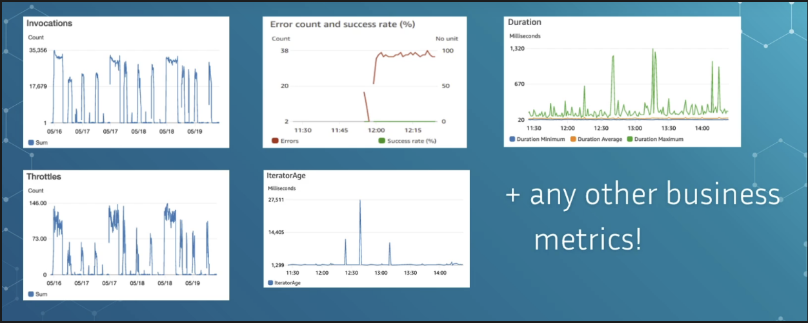

# Key Metrics To Monitor

### AWS Lambda Monitoring Overview

- Monitoring ensures system health and stability.
- Many useful CloudWatch metrics are **automatically collected for free**.
- Metrics help understand real-world performance and detect failures early.

------

### 🔹 Key Lambda Metrics to Monitor

**Invocations**

- Shows how frequently your function is being called.
- Track patterns: sudden spikes or drops may indicate abnormal usage or issues.

**Errors & Success Rate**

- Errors indicate failed executions; success rate shows percentage of successful runs.
- A spike in errors or a drop in success rate signals urgent issues (logic problems, timeouts, bad input, dependency failures).
- Common metric to set alarms on.

**Duration (Execution Time)**

- Default CloudWatch view shows:
  - Minimum
  - Average
  - Maximum
- These aren’t highly useful because they can be distorted by outliers.

**Preferred Metric: Percentiles**

- Use **P50, P90, P99** instead of min/max/avg.
- Gives a clearer picture of normal vs. slow executions.
- Teams commonly alert on **P90**.

**Throttles**

- Occur when concurrency limits are reached.
- Occasional throttles may be fine; persistent throttling means concurrency settings need adjustment.
- Should ideally stay at or near **zero**.

**Iterator Age**

- Relevant only for Lambda with **DynamoDB Streams or Kinesis**.
- Measures delay between event insertion and processing.
- High or continuously rising iterator age means the function can’t keep up with stream events.

**Business/Application-Specific Metrics**

- Custom metrics tied to business logic (example: % refunds vs purchases).
- Useful for detecting anomalies such as fraud patterns or behavioral changes.

------

### 🔹 How to Use Metrics Effectively

- Problems often require checking multiple metrics in combination (invocations + throttles + latency).
- Metrics are useless if not reviewed regularly.

------

### 🔹 Alerts & Automation

- Always configure alarms for key metrics (error rate, success rate, throttles, latency).
- Integrate alarms with systems like **SNS, PagerDuty, emails, SMS**.
- Critical for production environments—not optional.

------

### 🔹 Additional Metrics Worth Knowing

- **Concurrent Executions:** Current number of active executions.
- **Unreserved Concurrent Executions:** Execution count excluding reserved concurrency (helps debug competition between functions).

