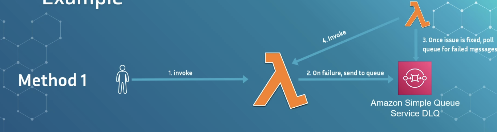
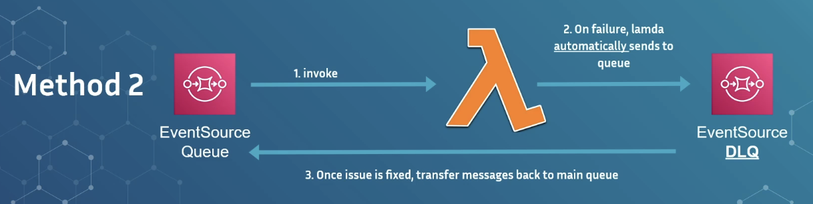

### Dead Letter Queue (DLQ) — Key Notes

- A **Dead Letter Queue (DLQ)** stores messages that **failed processing** so they can be retried later.
- DLQ is **not specific to Lambda or AWS** — it’s a pattern used in distributed systems.
- Purpose: prevent **loss of important messages** when dependencies (database, external API, service) are unavailable.
- Only useful when **message-driven workflows** exist.
   Not useful for synchronous APIs (REST/HTTP), because there's no point retrying after a user request already failed.

------

### 🟩 When DLQ Is Useful

- Asynchronous workloads
- Background tasks
- Event-driven systems
- Systems where message loss is unacceptable (payments, orders, notifications, audit logs)

------

### 🟧 How Failure Happens

- Lambda receives an event (ex: order event)
- It may need to call external systems (database, service, API)
- If those dependencies fail, the processing fails
- Instead of losing the message, it gets routed to a DLQ

------

### 🟪 DLQ Behavior

- Messages go to a DLQ **only after retries are exhausted**
- DLQ acts as temporary storage until the failure root cause is fixed
- Once ready, messages can be **replayed (redriven)** back to the original queue for reprocessing

------

### 🟨 Two Main DLQ Usage Models

#### 1️⃣ **Without SQS as Event Source (manual DLQ handling)**

- Lambda invoked directly (user ➜ API ➜ Lambda)
- Failure detected manually in code (try/catch)
- On failure, Lambda manually writes message to SQS (DLQ)
- Retrying requires:
  - A separate Lambda that polls DLQ and re-invokes original Lambda
  - Manual orchestration and retry strategy (exponential backoff)

➡️ More control, but **more complexity**

------

#### 2️⃣ **With SQS as Event Source (automatic DLQ behavior)**

Most common and recommended.

- Lambda receives events from SQS
- On failure, Lambda throws error normally (no special code required)
- SQS automatically retries message multiple times (configurable)
- After retry attempts are exhausted, message is moved to DLQ automatically

➡️ Best: **Fully automated hands-off recovery**

------

### 🔁 Retrying / Redriving Messages

- After dependency recovers, DLQ messages must be **manually redriven**
- Strategy:
  - Move them **back to the main queue**
  - Lambda processes them again

AWS Console supports **one-click redrive** for many cases.

------

### 🧰 Best Practices

- Always configure a DLQ in **production workloads**
- Set up **CloudWatch alarms** to notify you when DLQ message count > 0
  - Metric: **ApproximateNumberOfMessagesVisible**
- Have a **runbook/process** for replaying messages — do not wait until disaster hits
- Test your DLQ flow before going live